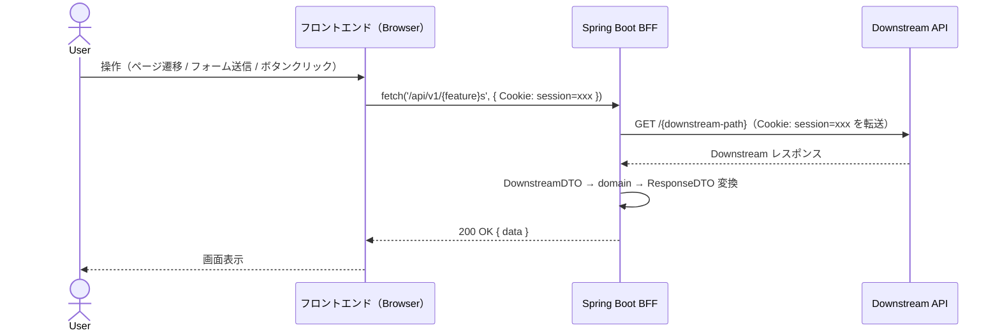
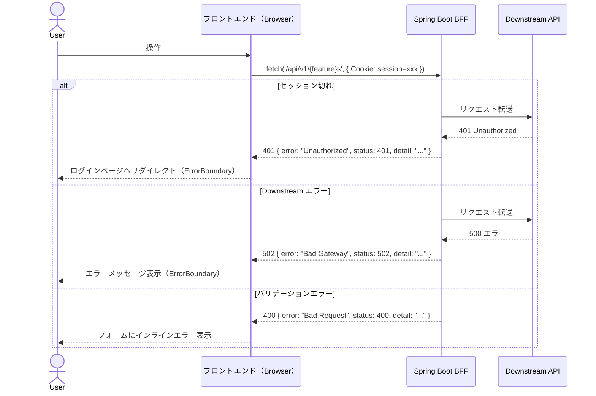

# /planning - Issue 計画コマンド

GitHub の Issue を分析し、設計・影響調査・タスク計画をまとめた `plan.md` を生成します。
生成物は `/dev <issue番号>` コマンドの入力として使用されます。

**使い方**: `/planning <issue_url>`  例: `/planning https://github.com/org/repo/issues/42`

---

## このコマンドが実行するプロセス

```
Step 1:   Issue 分析                  → 機能概要・受け入れ基準を把握
Step 1.5: 仕様確認                    → 未記載・曖昧な仕様をユーザーに質問・受け入れ基準に反映
          ↓ ユーザー回答
Step 2:   設計 & API コントラクト定義  → アーキテクチャ影響範囲・クラス図・フロー図
Step 3:   BDD シナリオ定義            → Gherkin（UI 仕様まで含めた具体的な記述）
Step 4:   Downstream モックデータ設計  → シナリオごとの WireMock スタブ設計
Step 5:   既存機能への影響調査         → 破壊的変更リスクを洗い出す
          ↓ ユーザー確認・承認
Step 6:   plan.md 生成                → docs/issues/{issue番号}/plan.md に保存
```

---

## Step 1: Issue 分析

```bash
gh issue view $ARGUMENTS --json number,title,body,labels,assignees,milestone,comments
```

取得した内容から以下を抽出・整理してください。

- **issue 番号**: 以降のディレクトリ名に使用する (`docs/issues/{issue番号}/`)
- **機能概要**: 何を実装するか
- **受け入れ基準 (Acceptance Criteria)**: 完了条件のリスト（BDD シナリオ候補）
- **影響範囲**: フロントエンド / BFF / 両方 / その他
- **非機能要件**: パフォーマンス・セキュリティ・アクセシビリティ等

---

## Step 1.5: 仕様の曖昧性・未記載事項の確認

受け入れ基準をもとに、実装を進めるにあたって**記載されていないこと・曖昧なこと**を洗い出し、ユーザーに確認します。
**質問が不要な場合（受け入れ基準がすべて明確）は、このステップをスキップしてください。**

### 確認観点

| 観点 | 例 |
|---|---|
| **UI/UX の未定義** | エラーメッセージの文言・空状態の表示・ローディング表示の有無 |
| **データ仕様の曖昧さ** | 表示件数の上限・ソートキーが同値の場合の優先順 |
| **異常系の未定義** | エラー発生時の振る舞い・リトライの有無 |
| **境界値の未定義** | 「最大〇件」「〇以上」等の境界が不明 |
| **操作フローの欠落** | 画面遷移の起点・完了後の遷移先 |
| **非機能要件の欠如** | パフォーマンス・アクセシビリティ要件 |

### ユーザーへの質問フォーマット

```
## 仕様確認

実装を進めるにあたり、以下の点が受け入れ基準に記載されていないか曖昧です。
確認させてください。

| # | 区分 | 質問 | 想定される選択肢 |
|---|---|---|---|
| Q1 | 未記載 | {質問内容} | A: {選択肢A} / B: {選択肢B} |
| Q2 | 曖昧   | {質問内容} | — |

回答をいただければ、BDD シナリオと受け入れ基準に反映します。
```

---

## Step 2: 設計 & API コントラクト定義

`ARCHITECTURE.md` と `DEVELOPMENT_RULES.md` を参照し、以下を決定してください。

### 2-1. 設計判断

- 新規 BFF エンドポイントが必要か → `/api/v1/{feature}/` のどのパスに追加するか
- 新規ページ・コンポーネントが必要か → `features/` のどの feature に追加するか
- 既存コードへの影響範囲（破壊的変更の有無）
- `openapi.json` の変更が必要か

### 2-2. API コントラクト定義

BFF が公開するエンドポイントと、対応する Kotlin DTO の型を定義します。
これは `docs/api/openapi.json` の変更内容の先行定義です。

```
エンドポイント一覧:
| メソッド | パス | 説明 | 認証 |
|---|---|---|---|
| GET | /api/v1/{feature}s | 一覧取得 | Cookie 必須 |
| POST | /api/v1/{feature}s | 新規作成 | Cookie 必須 |

BFF Response DTO（{Feature}Response）:
  id: String
  name: String
  ...

BFF Request DTO（Create{Feature}Request）:
  name: String（必須、1〜255文字）
  ...
```

### 2-3. クラス図の作成

以下の **2 つをセットで** Mermaid classDiagram で作成します。

#### ① BFF 内部（Downstream DTO → ドメインモデル → Response DTO 変換）

```mermaid
classDiagram
  namespace Downstream {
    class {Feature}DownstreamResponse {
      +String id
      +String rawName
    }
  }
  namespace Domain {
    class {Feature} {
      +String id
      +String name
    }
  }
  namespace Presentation {
    class {Feature}Response {
      +String id
      +String name
    }
  }
  {Feature}DownstreamResponse --> {Feature} : toDomain()
  {Feature} --> {Feature}Response : from(domain)
```

#### ② フロントエンド コンポーネント構成

Pages / Components の構成を `namespace` で区分します。
loader・action・useFetcher の用途をステレオタイプで明示します。

```mermaid
classDiagram
  namespace Pages {
    class {Feature}ListPage {
      <<loader: GET /api/v1/{feature}s>>
      <<action: POST /api/v1/{feature}s>>
    }
  }
  namespace Components {
    class {Feature}List {
      <<useLoaderData>>
    }
    class {Feature}Form {
      <<useFetcher / RHF + Zod>>
    }
  }
  {Feature}ListPage --> {Feature}List : renders
  {Feature}ListPage --> {Feature}Form : renders
```

**ルール**:
- **① と ② は必ずセットで作成すること**（片方だけ書かない）
- 変換（toDomain / from）・依存（uses）・ナビゲーション（navigates to）等の関係を矢印で明示すること

---

### 2-4. フロー図の作成

#### シーケンス図（正常系）



#### シーケンス図（異常系）



**ルール**:
- 正常系と異常系を必ず別図で描くこと
- フロントエンドのエラー処理（throw → ErrorBoundary / return → インライン表示）を明示すること

---

## Step 3: BDD シナリオ定義

受け入れ基準をもとに Gherkin 形式でシナリオを定義します。
各シナリオには **シナリオ ID（SC-1, SC-2, ...）** を付与します。

### Gherkin の記述レベル

Gherkin シナリオは `plan.md` に記録します。`.feature` ファイルは作成しません。
テストコードは `.spec.ts` のみに実装してください。

```typescript
// @SC-1
test("SC-1: {シナリオ名}", async ({ page }) => {
  // data-testid セレクター・具体的な期待値はここに書く
  await expect(page.locator('[data-testid="{feature}-card"]')).toHaveCount(5);
});
```

**ルール**:
- 受け入れ基準を1つ残らずシナリオに対応させること
- 正常系・異常系・境界値を網羅すること
- `.feature` ファイルは作成しないこと（Gherkin は plan.md で管理）

---

## Step 4: Downstream モックデータ設計（WireMock）

E2E テストは Docker Compose の WireMock コンテナで Downstream をモックします。
各シナリオが期待する WireMock スタブの内容を設計してください。

```markdown
## WireMock スタブ設計

### 正常系スタブ（docker-compose の WireMock 初期設定）

| エンドポイント | メソッド | レスポンス | 対応シナリオ |
|---|---|---|---|
| /{downstream-path} | GET | 200 + {JSON} | SC-1 |
| /{downstream-path} | POST | 201 + {JSON} | SC-2 |

### エラー系スタブ（テスト実行時に動的設定）

| シナリオ | エンドポイント | レスポンス |
|---|---|---|
| SC-5: 認証切れ | 全エンドポイント | 401 |
| SC-6: サーバーエラー | /{downstream-path} | 500 |
```

---

## Step 5: 既存機能への影響調査

### 調査方針

以下の観点でコードベースを調査し、リスクのある箇所を特定してください。

#### 1. ビジネスロジック・意味的な変更リスク（最重要）

- 新しい値・状態の追加により既存の条件分岐でその値が考慮されていないケースはないか
- 今回の追加・変更により、既存の一覧取得・集計結果が変わらないか
- 権限・アクセス制御の穴が生まれないか

#### 2. API コントラクト変更リスク

- 今回追加・変更するエンドポイントを既存のフロントエンドコードが利用していないか
- `docs/api/openapi.json` の変更が既存の生成型に影響しないか

#### 3. Feature 間の依存リスク

- 新しい feature が既存 feature に直接依存していないか（ESLint / ArchUnit で検出）

```bash
grep -rn "{変更対象キーワード}" --include="*.kt" bff/src/
grep -rn "{変更対象キーワード}" --include="*.tsx" --include="*.ts" frontend/
```

---

## Step 6: ユーザー確認 & plan.md 生成

調査結果をユーザーに提示し、**承認を得てから `plan.md` を生成してください**。

提示フォーマット:
```
## 計画サマリー

### 機能概要
{概要}

### BDD シナリオ一覧
| シナリオID | シナリオ名 | 種別 |
|---|---|---|
| SC-1 | ... | 正常系 |
| SC-2 | ... | 異常系 |

### API コントラクト
{エンドポイント一覧と DTO の概要}

### Downstream WireMock スタブ設計
{追加・変更が必要なスタブの概要}

### 既存機能への影響
| リスク | 種別 | 対処方針 |
|---|---|---|

この計画で問題ありませんか？ [yes / 修正内容を記載]
```

ユーザーが **yes** と回答したら、以下のファイルを生成してください。

### 生成するファイル

**`docs/issues/{issue番号}/plan.md`** — `/dev` コマンドが読み込む計画書:

```markdown
# 実装計画 - Issue #{issue番号}: {タイトル}

作成日時: {YYYY-MM-DD}
Issue URL: {url}

## 機能概要

{概要}

## 影響範囲

- [ ] BFF（新規エンドポイント / 既存変更）
- [ ] フロントエンド（新規ページ / 既存変更）
- [ ] openapi.json の変更

## API コントラクト

### BFF エンドポイント
| メソッド | パス | 説明 | 認証 |
|---|---|---|---|
| GET | /api/v1/{feature}s | ... | Cookie 必須 |

### Request / Response DTO 概要
（型定義の概要を記載。詳細は BFF の DTO ファイルと openapi.json で管理）

## クラス図

### BFF 内部（Downstream DTO → ドメインモデル → Response DTO）

\`\`\`mermaid
classDiagram
  %% Step 2-3 ① で作成したクラス図をそのまま貼り付ける
\`\`\`

### フロントエンド コンポーネント構成

\`\`\`mermaid
classDiagram
  %% Step 2-3 ② で作成したフロントエンドコンポーネント図をそのまま貼り付ける
\`\`\`

## シーケンス図

### 正常系

\`\`\`mermaid
sequenceDiagram
  %% Step 2-4 で作成した正常系シーケンス図をそのまま貼り付ける
\`\`\`

### 異常系

\`\`\`mermaid
sequenceDiagram
  %% Step 2-4 で作成した異常系シーケンス図をそのまま貼り付ける
\`\`\`

## BDD シナリオ一覧

| シナリオID | シナリオ名 | 種別 |
|---|---|---|
| SC-1 | {名前} | 正常系 |
| SC-2 | {名前} | 異常系 |

### シナリオ詳細（Gherkin）

\`\`\`gherkin
Feature: {機能名}

  Background:
    Given ユーザーがログイン済みである

  @SC-1
  Scenario: {シナリオ名}
    Given ...
    When  ...
    Then  ...
\`\`\`

## Downstream WireMock スタブ設計

### 正常系スタブ
| エンドポイント | メソッド | レスポンス | 対応シナリオ |
|---|---|---|---|

### エラー系スタブ（テスト実行時に動的設定）
| シナリオ | エンドポイント | レスポンス |
|---|---|---|

## 既存機能への影響調査結果

### 🔴 High リスク
| 影響機能 | ファイルパス:行 | リスク内容 | 対処方針 |
|---|---|---|---|

### 🟡 Medium リスク
| 影響機能 | ファイルパス:行 | リスク内容 | 対処方針 |
|---|---|---|---|

### 🟢 Low / 影響なし
{影響なしと判断した根拠}

## タスク計画

### Phase A: テストファースト（実装開始前・シナリオごとに実施）
| # | 内容 | 担当エージェント |
|---|---|---|
| A-1 | E2E テスト先行作成（シナリオ単位） | e2e-agent |

### Phase B: 実装（テスト承認後・シナリオごとに実施）
| # | 内容 | 担当エージェント | 依存 |
|---|---|---|---|
| B-1 | BFF 実装（Controller / UseCase / Gateway） | bff-agent | A-1 承認 |
| B-2 | フロントエンド実装（loader / action / components） | frontend-agent | A-1 承認 |
| B-3 | BFF テスト（Unit / Slice / Integration） | bff-test-agent | B-1 |
| B-4 | フロントエンド Integration テスト | frontend-test-agent | B-2 |
| B-5 | E2E テスト実行・Pass 確認 | e2e-agent | B-1・B-2 |
| B-6 | 内部品質レビュー | code-review-agent | B-1〜B-4 |
| B-7 | セキュリティレビュー | security-review-agent | B-1・B-2 |
```

生成完了後、以下を出力してください。

```
✅ 計画書を生成しました: docs/issues/{issue番号}/plan.md

次のステップ:
  /dev {issue番号}
```
