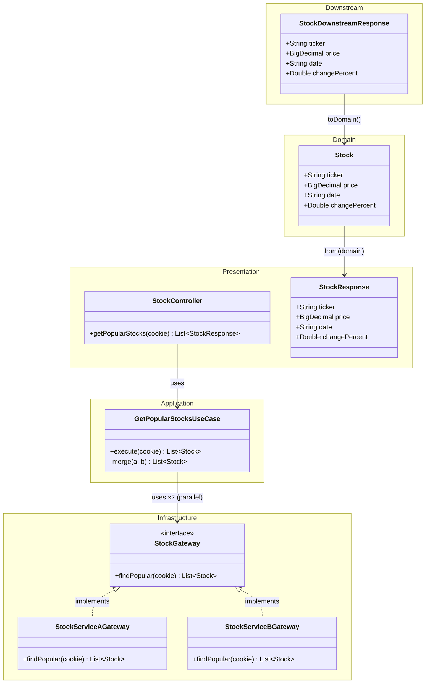
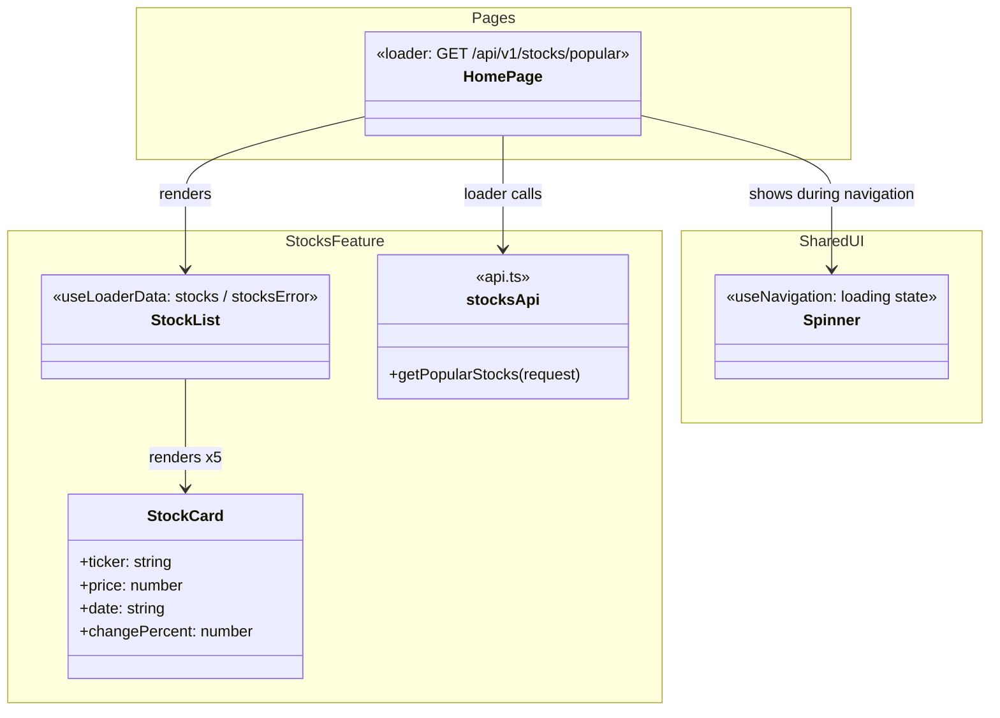
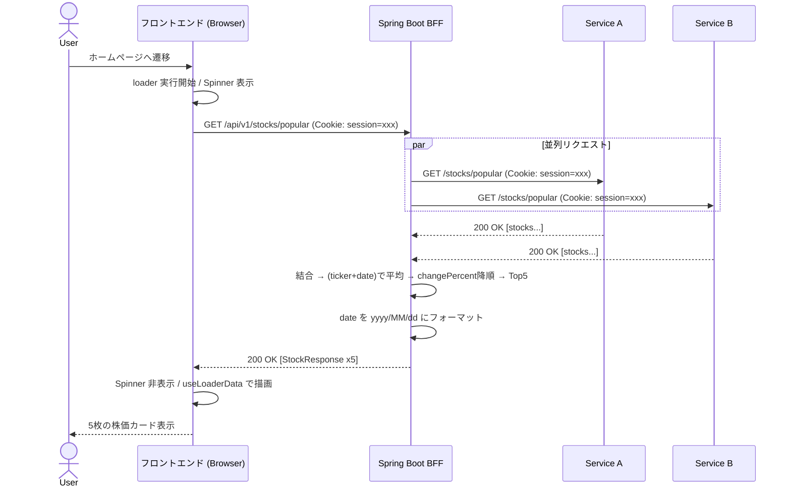
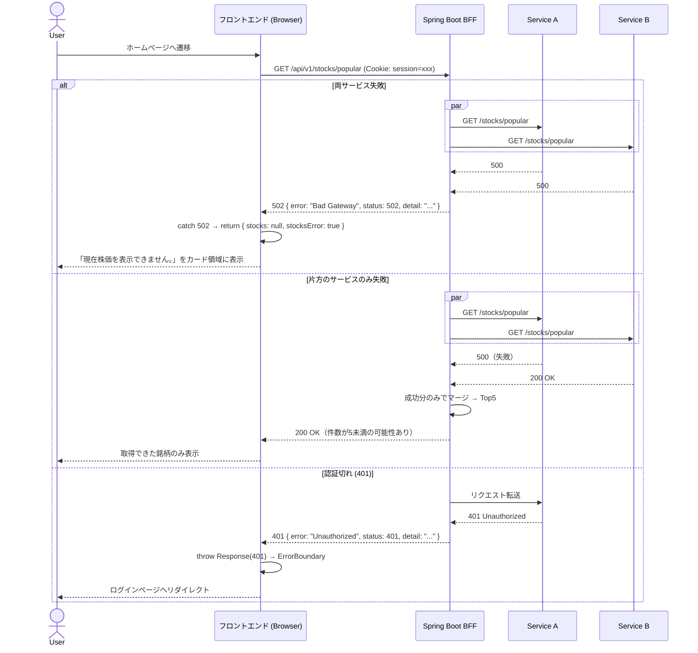

# 実装計画 - Issue #1: ユーザとして人気銘柄の株価を確認する

作成日時: 2026-03-29
Issue URL: https://github.com/sikes-311/react-reouter-bff/issues/1

## 機能概要

ログイン後のトップページ（`/`）に人気上位5銘柄の株価カードを表示する。
2つの Downstream サービスから並列取得し、同一 (ticker + date) のデータを平均化・マージ後、
changePercent 降順で上位5件を表示する。

## 影響範囲

- [x] BFF（新規エンドポイント）
- [x] フロントエンド（既存 home ページにローダー・コンポーネント追加）
- [x] openapi.json の変更（新規生成）
- [x] docker-compose.yml（WireMock コンテナを2つに分割）

## マージロジック

```
1. Service A / B へ CompletableFuture で並列リクエスト
2. 取得できたサービスの結果リストを結合（片方失敗の場合は成功分のみ）
3. (ticker + date) でグループ化し、price / changePercent を平均算出
4. changePercent 降順でソート
5. 上位5件を返却
※ 両方が失敗した場合は DownstreamServerException をスロー → 502 Bad Gateway
```

## API コントラクト

### BFF エンドポイント

| メソッド | パス | 説明 | 認証 |
|---|---|---|---|
| GET | /api/v1/stocks/popular | 人気上位5銘柄取得 | Cookie 必須 |

### Response DTO（StockResponse）

| フィールド | 型 | 説明 |
|---|---|---|
| ticker | String | ティッカーシンボル |
| price | BigDecimal | 株価 |
| date | String | 価格日付（yyyy/MM/dd） |
| changePercent | Double | 前日比（例: 1.23 = +1.23%） |

### Downstream レスポンス（Service A / B 共通）

`GET /stocks/popular` → 200 OK

```json
[
  { "ticker": "AAPL", "price": 175.50, "date": "2026-03-28", "changePercent": 1.23 }
]
```

### インフラ設定

| 設定キー | 説明 |
|---|---|
| downstream.service-a.base-url | Service A の base URL |
| downstream.service-b.base-url | Service B の base URL |

## クラス図

### BFF 内部（Downstream DTO → ドメインモデル → Response DTO）



### フロントエンド コンポーネント構成



## シーケンス図

### 正常系



### 異常系



## BDD シナリオ一覧

| シナリオID | シナリオ名 | 種別 |
|---|---|---|
| SC-1 | 両サービスのデータをマージし上位5銘柄が表示される | 正常系 |
| SC-2 | カードに銘柄・価格・日付・前日比が表示される | 正常系 |
| SC-3 | 前日比が正の場合、緑色+プラス符号で表示される | 正常系 |
| SC-4 | 前日比が負の場合、赤色+マイナス符号で表示される | 正常系 |
| SC-5 | "View more stock prices" リンクが表示される | 正常系 |
| SC-6 | 同一(ticker+date)は price/changePercent が平均値で表示される | 正常系 |
| SC-7 | 両サービス失敗時にエラーメッセージが表示される | 異常系 |
| SC-8 | 片方のサービス失敗時は取得できたデータのみ表示される | 異常系 |
| SC-9 | 認証切れ時にログインページへリダイレクトされる | 異常系 |

### シナリオ詳細（Gherkin）

```gherkin
Feature: 人気銘柄の株価確認

  Background:
    Given ユーザーがログイン済みである

  @SC-1
  Scenario: 両サービスのデータをマージし上位5銘柄が表示される
    Given Service A が3銘柄、Service B が3銘柄（うち1銘柄が重複）のデータを返す
    When  ユーザーがホームページにアクセスする
    Then  changePercent 降順で上位5枚の株価カードが表示される

  @SC-2
  Scenario: カードに銘柄・価格・日付・前日比が表示される
    Given 銘柄「AAPL」の価格が「175.50」、日付が「2026/03/28」、前日比が「+1.23%」である
    When  ホームページを表示する
    Then  カードに「AAPL」「175.50」「2026/03/28」「+1.23%」が表示される

  @SC-3
  Scenario: 前日比が正の場合、緑色+プラス符号で表示される
    Given 前日比が「+1.23%」の銘柄がある
    When  ホームページを表示する
    Then  前日比が緑色で「+1.23%」と表示される

  @SC-4
  Scenario: 前日比が負の場合、赤色+マイナス符号で表示される
    Given 前日比が「-0.45%」の銘柄がある
    When  ホームページを表示する
    Then  前日比が赤色で「-0.45%」と表示される

  @SC-5
  Scenario: "View more stock prices" リンクが表示される
    When  ホームページを表示する
    Then  "View more stock prices" リンクが表示される

  @SC-6
  Scenario: 同一(ticker+date)は price/changePercent が平均値で表示される
    Given Service A が「AAPL」の price=180.00、changePercent=2.00 を返す
    And   Service B が「AAPL」の price=170.00、changePercent=1.00 を返す（同一date）
    When  ホームページを表示する
    Then  「AAPL」カードの price が「175.00」、changePercent が「+1.50%」で表示される

  @SC-7
  Scenario: 両サービス失敗時にエラーメッセージが表示される
    Given Service A と Service B の両方が500エラーを返す
    When  ユーザーがホームページにアクセスする
    Then  株価カード領域に「現在株価を表示できません。」が表示される
    And   株価カードは表示されない

  @SC-8
  Scenario: 片方のサービス失敗時は取得できたデータのみ表示される
    Given Service A が500エラーを返す
    And   Service B が3銘柄のデータを返す
    When  ユーザーがホームページにアクセスする
    Then  Service B のデータから changePercent 降順で銘柄カードが表示される

  @SC-9
  Scenario: 認証切れ時にログインページへリダイレクトされる
    Given セッションが切れている
    When  ユーザーがホームページにアクセスする
    Then  ログインページへリダイレクトされる
```

## Downstream WireMock スタブ設計

### docker-compose 構成

| コンテナ名 | ポート | 対応サービス |
|---|---|---|
| downstream-mock-a | 8081 | Service A |
| downstream-mock-b | 8082 | Service B |

### 正常系スタブ（docker-compose 初期設定）

**downstream-mock-a: `wiremock/service-a/mappings/`**

| エンドポイント | メソッド | レスポンス | 対応シナリオ |
|---|---|---|---|
| /stocks/popular | GET | 200 + 3銘柄 JSON | SC-1〜SC-6 |

```json
[
  { "ticker": "AAPL",  "price": 175.50, "date": "2026-03-28", "changePercent":  1.23 },
  { "ticker": "GOOGL", "price": 178.20, "date": "2026-03-28", "changePercent": -0.45 },
  { "ticker": "MSFT",  "price": 420.30, "date": "2026-03-28", "changePercent":  0.78 }
]
```

**downstream-mock-b: `wiremock/service-b/mappings/`**

| エンドポイント | メソッド | レスポンス | 対応シナリオ |
|---|---|---|---|
| /stocks/popular | GET | 200 + 3銘柄 JSON（AAPL は重複） | SC-1〜SC-6 |

```json
[
  { "ticker": "AAPL",  "price": 170.00, "date": "2026-03-28", "changePercent":  1.00 },
  { "ticker": "AMZN",  "price": 195.80, "date": "2026-03-28", "changePercent":  2.10 },
  { "ticker": "NVDA",  "price": 890.40, "date": "2026-03-28", "changePercent": -1.35 }
]
```

> SC-6 検証: AAPL の price = (175.50 + 170.00) / 2 = 172.75、changePercent = (1.23 + 1.00) / 2 = 1.115

### エラー系スタブ（テスト実行時に動的設定）

| シナリオ | mock-a | mock-b |
|---|---|---|
| SC-7: 両方失敗 | 500 | 500 |
| SC-8: 片方失敗 | 500 | 200（正常） |
| SC-9: 認証切れ | 401 | 401 |

## 既存機能への影響調査結果

### 🔴 High リスク

なし

### 🟡 Medium リスク

| 影響機能 | ファイルパス | リスク内容 | 対処方針 |
|---|---|---|---|
| Docker Compose | docker-compose.yml | downstream-mock を2コンテナに分割するため既存構成変更が必要 | BFF の環境変数（base-url）も合わせて更新 |

### 🟢 Low / 影響なし

- `routes/home.tsx`: 現在は Welcome 表示のみ。loader 追加は新規追加であり破壊的変更なし
- `application.yml`: `downstream.base-url` を2つに分割するが既存機能なし
- `openapi.json`: 新規生成のため既存の生成型への影響なし
- `features/auth/`: 本機能は独立した `features/stocks/` に実装するため依存関係なし

## タスク計画

### Phase A: テストファースト（実装開始前・シナリオごとに実施）

| # | 内容 | 担当エージェント |
|---|---|---|
| A-1 | E2E テスト先行作成（SC-1〜SC-9） | e2e-agent |

### Phase B: 実装（テスト承認後・シナリオごとに実施）

| # | 内容 | 担当エージェント | 依存 |
|---|---|---|---|
| B-1 | BFF 実装（StockController / GetPopularStocksUseCase / StockServiceA・BDownstreamGateway） | bff-agent | A-1 承認 |
| B-2 | フロントエンド実装（loader / StockList / StockCard / api.ts） | frontend-agent | A-1 承認 |
| B-3 | BFF テスト（Unit / Slice / Integration） | bff-test-agent | B-1 |
| B-4 | フロントエンド Integration テスト（Vitest + MSW） | frontend-test-agent | B-2 |
| B-5 | E2E テスト実行・Pass 確認 | e2e-agent | B-1・B-2 |
| B-6 | 内部品質レビュー | code-review-agent | B-1〜B-4 |
| B-7 | セキュリティレビュー | security-review-agent | B-1・B-2 |
